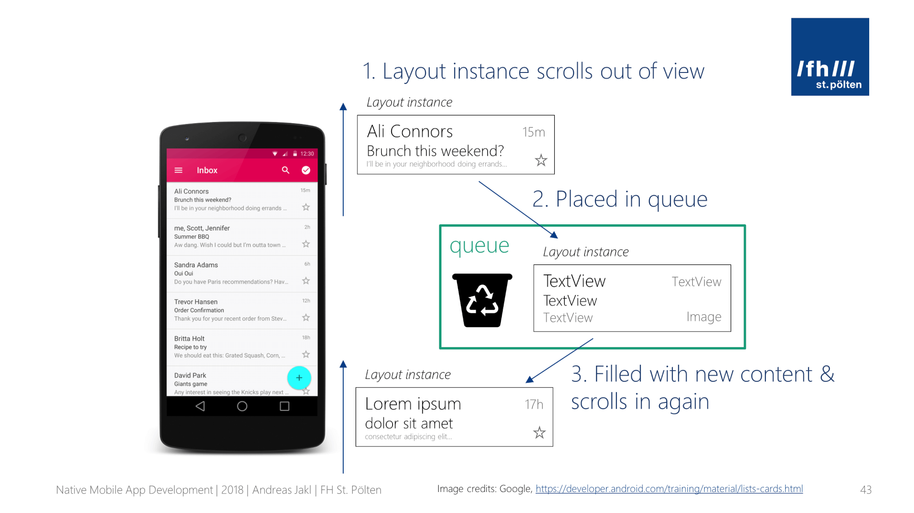

# Data Classes y RecyclerView

## Objetivo

En este laboratorio aprenderemos la estructura básica de una aplicación utilizando el desarrollo de listas.

Para este laboratorio vamos a desarrollar un Pokedex, que es una unidad de información para el mundo Pokemon. Esta aplicación nos mostrara los datos de cada criatura y desde ahí podremos generar un detalle.

Esta aplicación utiliza el concepto básico de actividades e irá evolucionando hasta que incorporemos la arquitectura en el mismo.

## Instrucciones

Sigue los pasos descritos en la siguiente práctica, si tienes algún problema no olvides que tus profesores están para apoyarte.

## API
Para este laboratorio estaremos utilizando el API de [PokeAPI](https://pokeapi.co/) los endpoints con los que vamos a comenzar son los siguientes:

```
GET https://pokeapi.co/api/v2/pokemon/?limit=1279
GET https://pokeapi.co/api/v2/pokemon/{number_pokemon}/
```

## Laboratorio

### Paso 0 Configuración de Dispositivo

En este paso vamos a configurar Xcode para que puedas correr tu proyecto en un dispositivo físico, en caso, de que quieras usar solo el simulador de Xcode puedes pasar directamente al Paso 1 del laboratorio.

Primero que nada ten a la mano las credenciales de tu **Apple ID**, si no lo recuerdas el Apple ID, es el que creaste o utilizas en tus dispositivos Apple

Ingresa a la página de [Apple Developers](https://developer.apple.com) y dirigete al apartado de **Account**

%203.05.48.png)

Inicia sesión con tu AppleID, en caso de no tener AppleID, en la parte de abajo se encuentra la opción de ¿No tienes un Apple ID? Crea el tuyo ahora.

Una vez que inicies sesión te pedirá que aceptes el Apple Developer Agreement

%203.28.20.png)

Perfecto, ahora que los aceptaste tienes acceso al portal de desarrolladores de Apple.

Para seguir con este proceso ahora abre Xcode, no es necesario que crees un nuevo proyecto por el momento, ve a la barra de menús y ve a Xcode -> Settings -> Accounts y agrega tu cuenta como Apple ID.

%204.05.20.png)

Ingresa tu AppleID, contraseña y código de verificación que se te solicita y listo conecta tu dispositivo.

Para poder usarlo de manera inalámbrica sigue los siguientes pasos:

1. Mientras tu dispositivo físico está conectado a la computadora
2. Dirígete a la barra de navegación en Window -> Devices
3. En la ventana que aparece ve a la información de tu dispositivo y asegúrate de que el checkbox Connect via network está activado

%2017.46.00.png)

### Paso 1 Creación del Proyecto

Vamos a empezar creando un proyecto desde 0, por lo que vamos a abrir Xcode y vamos a realizar las siguientes configuraciones.

%2023.32.44.png)

Después vamos a seleccionar un template de iOS tipo **App**.
%2023.48.49.png)

Los siguientes parámetros los añadiremos de la siguiente forma:
```
Name: Pokedex
Team: None
Organization Identifier: com.example
Interface: SwiftUI
Language: Swift
```

%200.25.28%201.png)

Con esta configuración base damos clic en **Next** y dejamos que el proyecto empiece a crearse.

Para este punto del curso ya debes tener listo tu Xcode configurado En cualquier caso si necesitas configurar todavía algo no olvides revisar la sección de materiales del repositorio para ayudarte a terminar con estos pasos.

Una vez que haya finalizado de configurarse deberemos ver algo como lo siguiente:
%200.34.50.png)

Para esta ocasión vamos a notar lo siguiente de nuestra estructura de proyecto.

1. En la carpeta **Pokedex**, se encuentran todos los archivos .swift del proyecto
2. En la carpeta de **Assets**, es donde puedes agregar el ícono de la aplicación, imágenes que desees utilizar y colores, recuerda que puedes organizarlos por carpetas.
3. La carpeta de **PokedexTests**, corresponde al espacio en donde encontrarás los archivos que utilices para realizar *pruebas unitarias* del proyecto.
4. La carpeta de **PokedexUITests**, corresponde al espacio en donde encontrarás los archivos que utilices para realizar *pruebas de interfaz* del proyecto.
5. **PokedexApp** es el archivo principal que es donde comienza tu aplicación.
6. El package principal del proyecto *Pokedex (color azul)* es en donde puedes hacer el cambio de versiones y configuraciones adicionales como el uso de **capabilities** y la integración de librerías a través de **Swift Package Manager**.

### Paso 2 Configuración del Proyecto

Para este paso vamos a abrir el package principal *Pokedex* e ir a la sección de Project Pokedex -> Package Dependencies

%201.59.49.png)

Recuerda que Xcode tiene integrado el uso de Swift Package Manager, si deseas agregar librerías con CocoaPods o Carthage el procedimiento será distinto. 

Lo que vamos a hacer ahora es añadir las librerías que necesitamos para este proyecto.

#### Alamofire

Esta librería es una de las más comunes en el mundo de iOS para hacer conexiones con APIs y HTTP, es de las más ampliamente documentadas en tutoriales por lo que es la que recomiendo que utilices para el proyecto.

**Nota: Puedes hacer el uso de cualquier librería pero recuerda que es una mala práctica hacer conexiones a las Bases de Datos de manera directa, para ello se recomienda el uso de APIs para trabajar en ello o el uso de capas diferentes para acceso a la información.**

Dicho lo anterior, dentro de los **package dependencies** vamos a dar clic en el icono de +:

%202.10.18.png)

Busca la librería de Alamofire a través del siguiente link de la siguiente manera:
```
https://github.com/Alamofire/Alamofire.git
```

%202.37.46.png)

Espera a que finalice la descarga y da clic en **Add Package** en la ventana emergente.

#### SDWebImageSwiftUI

Esta librería nos ayudará para poder cargar imágenes de Internet, es ampliamente usada por que resuelve problemas comunes pero difíciles de manejar como que la imagen venga girada por default y evita que tengamos que hacer más procesamiento o en su defecto sus extensiones permiten agregar efectos como **blur**, imágenes circulares, entre otros.

Siguiendo la misma idea de la librería de **Alamofire**, vamos a añadir la siguiente librería:

```
//SDWebImageSwiftUI
https://github.com/SDWebImage/SDWebImageSwiftUI
```

El resultado final deberá verse algo como:
%202.46.22.png)

### Paso 3 App Structure

Como se mencionó anteriormente **PokedexApp** es el archivo principal de nuestro proyecto, este archivo es una descripción del contenido y el comportamiento de nuestra aplicación. Cada uno de nuestros proyectos solo tiene un App Structure. Vamos a revisar el contenido de este archivo

Primero que nada esta la importación de la librería de SwiftUI, esto para que podamos utilizar los símbolos y características del mismo.

Para indicar que este archivo es el punto de entrada del proyecto de SwiftUI, la clase contiene el atributo `@main` en el app structure, así como también podemos ver el uso de **protocolos**

```
struct MyApp: App
```

El protocolo *App* es el que provee el contenido y el comportamiento de la aplicación. Cada protocolo tiene sus métodos y atributos que son requeridos y en este caso es la propiedad de `body` que regresa el contenido de la app como una *Scene*. Si lo recuerdas la escena son las vistas que el usuario ve en nuestra interfaz final y están compuestas por una jerarquía de vistas. Existen varios tipos de escenas:

1. Window Group: es el que normalmente se utiliza para manejar múltiples escenas en los dispositivos.
2. Window: uso exclusivo para sistemas operativos macOS y permitir que la aplicación se cierre una vez que cierran la vista, es decir, la app no entrará en modo background. Más adelante veremos los ciclos de vida de una aplicación
3. Document Group: puede ser utilizado para crear aplicaciones destinadas para manejar la creación, edición y guardado de documentos como los procesadores de texto (e.g. Word)
4. Settings: al igual que Window, se puede utilizar solo en macOS y permite que puedas abrir el menu de settings desde tu aplicación

Por lo tanto la que se esta utilizando aquí es el Window Group que contiene la ventana principal que nuestra app va a desplegar, por default se utiliza ContentView, una vista personalizada que contiene una imagen y un texto. Este podemos cambiarlo en cualquier momento.

### Paso 4 Ciclo de vida de la aplicación

Además de nuestra vista principal en el App Structure, se comentó que también podemos manejar el ciclo de vida de nuestra aplicación. Los estados que nuestra aplicación puede tener son los siguientes:


El sistema operativo mueve las escenas de tu aplicación a través del ciclo de vida, cada uno estos te ayudarán en el desarrollo de la aplicación para cuando tengas que manejar ciertos eventos como ejecutar acciones en background como enviar una notificación una vez que el usuario cierre la app o mostrar algún mensaje cuando el usuario regresa a tu aplicación.

Para probar las diferentes fases puedes utilizar el siguiente código en tu **Pokedex App** 

```
import SwiftUI

@main
struct PokedexApp: App {
    @Environment(\.scenePhase) var scenePhase

    var body: some Scene {
        WindowGroup {
            ContentView()
        }.onChange(of: scenePhase) { (newScenePhase) in
            switch newScenePhase {
            case .background:
                print("App State : Background")
            case .inactive:
                print("App State : Inactive")
            case .active: // Foreground
                print("App State : Active")
            @unknown default:
                 print("App State : Unknown")
            }
        }
    }
}
```

Vamos por partes para entender el código

`@Environment` se le conoce como un **property wrapper** que lee los valores de ambiente de una vista (e.g. scenePhase, colorScheme), si el valor de las variables cambia se ejecutará la acción que hayas definido, como en el ejemplo que dependiendo del estado de la aplicación imprime el valor en el que se encuentra. Como cualquier property wrapper puedes leer los valores pero no modificarlos. 

> Puedes consultar los diferentes valores que puedes usar a través del ambiente en la siguiente liga: [Environment Values](https://developer.apple.com/documentation/swiftui/environmentvalues)

Ahora vamos con el onChange

`.onChange(of: scenePhase) { (newScenePhase) in`

En SwiftUI lo más utilizado son los **modificadores** que normalmente sucede de } al finalizar una un componente; en este caso el modificador de onChange funge como un observer sobre la variable scenePhase, es decir, vigila en todo momento el valor de la variable y en cuanto detecta algún cambio ejecuta lo que se encuentre dentro de las llaves  { }

Posteriormente a la apertura de la llave tenemos `newScenePhase` entre paréntesis, la cual, contiene el nuevo valor de scenePhase, y así podemos realizar el switch sobre `newScenePhase`

Ya que entendimos el código, vamos a correr la aplicación para que puedas entender mejor el ciclo de vida.

Para correr la aplicación vamos a dirigirnos a la barra de navegación superior de Xcode 

%203.48.50.png)

1. Encontraremos el botón de play para correr nuestra aplicación
2. En caso de que tengas ligado un repositorio a tu proyecto aquí podrás ver los branches disponibles y crear nuevos.
3. Es el target del proyecto, debes asegurarte que este coincida con el nombre de tu proyecto, ya que este es el que correrá la aplicación.
4. Aquí puedes seleccionar el dispositivo en el que quieres simular el proyecto, puede ser alguno de los simuladores que tienes instalados o tu dispositivo físico.
5. El estado del proyecto, si encuentra compilando, corriendo, pausado, etc.

Entonces para que puedas probar los ciclos de vida de la aplicación corre el proyecto y juega con los diferentes estados, ve las impresiones que realiza tu aplicación en la **consola** mientras pasas por los diferentes estados.

La **consola** de Xcode, se abrirá automáticamente cuando abras el proyecto, sin embargo, verifica que el panel derecho se encuentre activado para que puedas ver las impresiones.

%204.12.39.png)

En nuestro simulador/dispositivo podemos encontrar la aplicación de la siguiente manera:


### Paso 5 Estructurando modelos de datos en Swift

Para comenzar a trabajar con la conexión a nuestro API, necesitamos establecer algunas bases.

Si bien podemos conectarnos directamente al API y obtener el JSON respuesta, nuevamente debemos establecer que esto no es una buena práctica, ya que los sistemas y arquitecturas modernos deben ser capaces de poder probar la capa que están utilizando, en este caso en un nivel muy elemental de MVC (Modelo, Vista, Controlador) la capa del Modelo que es la encargada de los datos necesita poder validar todas las posibles respuestas que se den.

Es en este sentido que una de las peticiones de Alamofire pero que debe permearse a cualquier implementación de la capa de Modelos es que debemos mapear el objeto respuesta en objetos propios para mantener la unicidad de la arquitectura.

Aquí es donde entran los **struct** de tipo **data class** que no son otra cosa que los objetos mapeados de respuesta de nuestros elementos ya sean bases de datos locales, APIs u otros que pudieran existir en nuestra aplicación.

Con eso en mente vamos a tomar una muestra de la respuesta a la llamada del API.

```
GET https://pokeapi.co/api/v2/pokemon/?limit=1279
```

```
{
	"count": 1279,
	"next": null,
	"previous": null,
	"results": 
		[
			{
				"name": "bulbasaur",
				"url": "https://pokeapi.co/api/v2/pokemon/1/
			},
			{
				"name": "ivysaur",
				"url": "https://pokeapi.co/api/v2/pokemon/2/"
			}
		]
}
```

Lo que debemos hacer con nuestro data clase es mapear nuestro objeto para obtener toda la información útil del JSON.

Para comenzar vamos a crear una carpeta (File -> New -> Group) que se llame Modelos, y dentro de esta carpeta vamos crear una nuevo archivo tipo Swift, archivo que llamaremos **Pokedex** 

**Nota: La construcción de conexión con el API ejemplo es un poco diferente a lo normal puesto que sus datos se obtienen mediante muchas llamadas, esto puede afectar el rendimiento del lado del servidor, por tanto para tu proyecto asegúrate que el API construida sea funcional y óptima tanto para la app como para tu servidor.**

%204.44.54.png)

%204.49.11.png)

Lo que debemos hacer es definir cada uno de los parámetros de nuestra API que vamos a utilizar dentro de nuestro  **modelo**.

Para empezar vamos a agregar el siguiente código

```
import Foundation

struct Pokedex {
	var count: Int
	var results: [Pokemon]
}

struct Pokemon {
    var name: String
    var url: String
}
```

Como te has dado cuenta hemos creado dos modelos uno para cada pokemon y otro para la información general de Pokedex. En el caso de Swift para poder hacer el decoding de un arreglo de JSON's, cada JSON debe ser mapeado siempre son variables primitivas.

Los **structs** son tipo de datos personalizados que pueden almacenar múltiples valores de diferentes tipos. También nota que utilizas var para cada uno de los atributos, esto para que puedan ser modificables una vez inicializados, sin embargo, si quieres usar los valores como constantes puedes utilizar let.

Ya tenemos la base general de nuestro Pokemon, pero el API que tenemos en vez de regresarnos la información de un Pokemon, solo nos regresa el nombre y una url que es la que contiene todo el detalle, incluido imágenes, habilidades entre otras cosas.

Ahora vamos a tomar el segundo link del API para nuestro laboratorio 

```
GET https://pokeapi.co/api/v2/pokemon/1/
```

Si revisamos este link en nuestro navegador o en postman, o en cualquier herramienta de visualización de APIs de tu preferencia podrás ver a lo que me refiero con toda la información del pokemon.

En este caso es solo del primero **charmander** pero la estructura es la misma para todos los demás.

Y agrega el siguiente código al modelo Pokedex para que tengamos el modelo correspondiente a las imágenes del pokemon, solo vamos usar las propiedades necesarias para este laboratorio. 

```
struct Perfil {
	var sprites: Sprite
}

struct Sprite {
	var front_default: String
	var back_default: String
}
```

Por último vamos a agregar un modelo de PokemonBase para que podamos utilizar la información en conjunto de lado de la interfaz

```
struct PokemonBase {
    var pokemon: Pokemon
    var perfil: Perfil
}
```

Al final la estructura de nuestro código quedará de la siguiente manera.
%206.12.53.png)

**Nota: Existe debate entre que es lo ideal, si obtener toda la información del API, o solo obtener la información necesaria, lo que va a usar la app, si bien no existe una respuesta correcta, mi recomendación es por seguridad y optimización trata de usar solo lo necesario pero en ocasiones deberás usar o almacenar los objetos completos cuando se trate con bases de datos locales.**

Con esto hemos terminado de configurar nuestros **modelos** del laboratorio, en los siguientes paso empezaremos a configurar una lista en SwiftUI antes de hacer nuestra conexión con el API.

### Paso 6 Lista en SwiftUI

Para continuar el laboratorio debemos mencionar uno de los aspectos fundamentales en el desarrollo móvil.

El concepto de lista->detalle.

Más que un concepto teórico es una forma de visualizar las aplicaciones tratando de encasillar cada una en un tipo ya sea una lista o un detalle.

Por ejemplo:

Un inicio de sesión, una vista de ver un video un menú principal podemos categorizarlas como **Detalles**.

Las películas que se tienen disponibles, los usuarios de un sistema, los cursos disponibles o en nuestro caso el conjunto de Pokemon podemos categorizarlos como **Listas**.

Otro beneficio de este concepto es que eso nos permite hacer toda la navegación de una aplicación por ejemplo:

Un inicio de sesión que lleva a una lista de elementos que al dar clic abre el detalle de ese elemento particular podemos pensarlo traducirlo.

Detalle ->Lista -> Detalle

Poder identificar cada uno de estos permite cuantificar la complejidad de las vistas, por lo general los detalles son más complejos puesto que requieren más trabajo de diseño o incluso contienen componentes complejos.

Para el caso de las listas se requiere de la lista y el diseño de la celda que casi siempre es básico, aunque como todo diseño siempre se puede complicar.

También en las aplicaciones más modernas podemos tener Detalles que contienen listas, pero en estos casos siguen siendo detalles puesto que el nivel de complejidad del diseño son elementos básicos de UI más aparte la lista que los compone.

Por último una vista de tipo Lista que incluye componentes como búsquedas y filtros podemos considerarlas todavía como Listas ya que los elementos de complejidad no son de interfaz son más de cuestión lógica.


En el ejemplo anterior tenemos una lista y un detalle, si abstraemos la celda de la lista podemos ver que en complejidad es mucho más simple que el detalle completo.

Una vez que entendemos estos conceptos básicos te puedo decir que lo único que hace falta para hacer **Detalles** es practicar e implementar diseños diferentes para entender bien los diferentes componentes y sus propiedades.

Para el caso de las **Listas** necesitamos cubrir su implementación hasta llegar al diseño de la celda en donde podemos seguir practicando así como con los **Detalles** los diferentes componentes y sus propiedades.

En iOS tenemos un varias formas de implementar el concepto de **Listas**, una es utilizando un **ForEach** y la otra es utilizando un **List**, el más óptimo es el uso de List

**List** es una lista con esteroides pues como su nombre lo indica va reciclando los objetos de la lista para mejorar el rendimiento de la memoria del celular.

Pensemos en una app como Netflix, la cual tiene muchas películas, guardar todas las celdas de golpe como lo hace el **ForEach** no es la manera más óptima puesto que aquí depende del programador mejorar su implementación ya sea con paginación, con lazy loading, o tener su propio algoritmo para evitar que la memoria se acabe.

Incluso celdas muy complejas en ciertas listas pueden llevar a implementaciones difíciles, en ese aspecto el **List** reduce todo el trabajo.



Con la imagen anterior podemos ver un poco que es lo que pasa, al momento de hacer Scroll, la celda que está hasta arriba se "elimina" por lo que al dejar de estar visible libera sus recursos para que la celda de hasta abajo pueda ser cargada y mantener equilibrio en el uso de recursos.

Este equilibrio se hace con 2 celdas más allá de la actual, no solo con lo que está visible en pantalla.

En una situación de ganar ganar si una celda es muy compleja y por tanto muy grande solo cargaría pocas celdas en la lista para permitir la cantidad de recursos disponibles en lo que está disponible en pantalla.

Ahora bien ya que entendemos sobre el **List**, ¿Qué necesitamos para implementarlo? El proceso es bastante lineal y sencillo.

Vamos a trabajar sobre el archivo de **ContentView**

1. Creamos la lista con el siguiente código:
```
struct ContentView: View {
    var body: some View {
        List {
            Text("Item 1")
            Text("Item 2")
            Text("Item 3")
        }
    }
}
```

1. Crear el arreglo que contiene la lista de pokemon
```
struct ContentView: View {
    @State var pokemon = [PokemonBase]()
```

Recuerda que anteriormente ya habíamos visto la sintaxis de @Environment, que era un property wrapper, en este caso estamos utilizando `@State` que nos permite vigilar el estado de la variable pokemon en esta vista.

3. Vamos a crear cada row de nuestra lista utilizando la librería que habíamos importado en un inicio SDWebImageSwiftUI

Importa la librería

```
import SDWebImageSwiftUI
```

Reestructura la lista de la siguiente manera: 
```
List(pokemonList) { pokemonBase in
	HStack {
		WebImage(url: URL(string: pokemonBase.perfil.sprites.front_default))
		   .resizable() // Resizable like SwiftUI.Image, you must use this modifier or the view will use the image bitmap size
		   .scaledToFit()
		   .frame(width: 48, height: 48, alignment: .center)
		Text(pokemonBase.pokemon.name)
	}
}
```

Fíjate que a la lista le estamos pasando como parámetro el arreglo de datos sobre el que queremos iterar, de ahí declaramos la variable que va a usar nuestro iterador que en este caso es `pokemonBase`. 

Para cada pokemonBase de la lista pintaremos un `HStack`, que no es más que un contenedor horizontal para ordenar los objetos de la imagen del pokemon y el texto.

Para la imagen vamos a utilizar el componente de WebImage, es importante mencionar que este solo se puede utilizar si se importa la librería de SDWebImageSwiftUI.

Y para el texto vamos a utilizar un Text() que entre los paréntesis contiene el texto que queremos que muestre.

Ahora el compilador nos está mandando el siguiente error

```
Initializer 'init(_:rowContent:)' requires that 'PokemonBase' conform to 'Identifiable'
```

Esto es porque, la manera que tiene SwiftUI para identificar cada celda es a través del protocolo Identifiable, lo único que tenemos que hacer es agregarlo a nuestro modelo de PokemonBase.

```
struct PokemonBase: Identifiable {
    var id: Int

    var pokemon: Pokemon
    var perfil: Perfil
}
```

Tal protocolo nos obligará a agregar una propiedad al modelos que le permita a SwiftUI mantenerlo como único.

Para poder tener datos de prueba hay que crearlos a mano :)

Esto lo puedes hacer en la parte de abajo de nuestro archivo de ContentView de la siguiente manera

```
struct ContentView_Previews: PreviewProvider {
    static var previews: some View {
        let pokemon = Pokemon(name: "bulbasaur", url: "")
        let pokemon2 = Pokemon(name: "charmander", url: "")
        let pokemon3 = Pokemon(name: "squirtle", url: "")
        
        let perfil = Perfil(sprites: Sprite(front_default: "", back_default: ""))
        let perfil2 = Perfil(sprites: Sprite(front_default: "", back_default: ""))
        let perfil3 = Perfil(sprites: Sprite(front_default: "", back_default: ""))

        let pokemonBase = PokemonBase(id: 1, pokemon: pokemon, perfil: perfil)
        let pokemonBase2 = PokemonBase(id: 2, pokemon: pokemon2, perfil: perfil2)
        let pokemonBase3 = PokemonBase(id: 3, pokemon: pokemon3, perfil: perfil3)

        let pokemonList : [PokemonBase] = [pokemonBase, pokemonBase2, pokemonBase3]

        ContentView(pokemonList: pokemonList)
    }
}
```

Con esto ya tendremos toda la configuración de la lista y podemos utilizar el preview de Xcode, este lo puedes activar desde la barra de navegación en Editor -> Canvas

El camino ha sido largo pero si hacemos un resumen tenemos lo siguiente:

1. Proyecto configurado con sus librerías correspondientes
2. Manejar el ciclo de vida de una aplicación
3. Vista principal **ContentView** lista
4. Modelos de **datos** ajustados a las respuestas de nuestro API
5. Una **List** completa para desplegar un conjunto de datos de prueba.

El resultado final podrás verlo en le preview debería verse de la siguiente manera:

%206.41.11.png)

Si quieres ver como funciona mejor, intenta añadiendo más elementos a la lista de pruebas de los Pokemon, y añade imágenes desde una url cuando creamos los pokemon

De momento llegaremos hasta aquí en este laboratorio, en el próximo vamos a terminar la conexión con el API y ver el despliegue de la información.
