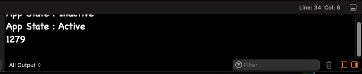

# Consumiendo APIs

## Objetivo

En este laboratorio aprenderemos sobre conexión a sistemas externos.

Para este laboratorio vamos a desarrollar un Pokedex, que es una unidad de información para el mundo Pokemon. Esta aplicación nos mostrara los datos de cada criatura y desde ahí podremos generar un detalle.

Esta aplicación seguirá evolucionando conforme avancemos.

**Nota: Al final de este laboratorio te recomiendo que generes una copia para que en los próximos tengas un punto de comparación sobre lo que se va avanzando.

## Instrucciones

Sigue los pasos descritos en la siguiente práctica, si tienes algún problema no olvides que tus profesores están para apoyarte.

## API
Para este laboratorio estaremos utilizando el API de [PokeAPI](https://pokeapi.co/) los endpoints con los que vamos a comenzar son los siguientes:

```
GET https://pokeapi.co/api/v2/pokemon/?limit=1279
GET https://pokeapi.co/api/v2/pokemon/{number_pokemon}/
```

## Laboratorio
### Paso 1 Configuración de Alamofire

En el laboratorio anterior nos quedamos con una aplicación con una lista cargada desplegando los 3 Pokemon básicos.

De momento nuestra aplicación no carga Imágenes y tampoco muestra datos reales devueltos desde nuestra aplicación.

Cuando estuvimos configurando el proyecto agregamos varias librerías para el proyecto, una de las librerías de terceros habíamos visto que es Alamofire.

Como mencionamos Alamofire es una librería que permite la incorporación de peticiones HTTP mediante API REST. Esto es en palabras simples la incorporación de APIs y conexión de datos con nuestra aplicación.

Este paso es elemental para poder cargar cualquier dato de Internet en la aplicación.

Puede que tengas la tentación de buscar un tutorial para conectarte directamente con tu DBMS siendo por ejemplo: MySQL, SQLLite, Postrgess, MongoDB, etc.

Recuerda que hacer la conexión directa a la base de datos genera riesgos y problemas de seguridad importantes por lo que en un nivel básico de protección se recomienda el uso de APIs para la conexión con datos. Plataformas como Firebase nos ayudan a hacer esto de manera más automática puesto a que tenemos una base de datos particular y Firebase nos ofrece un SDK el cual genera un API brindando esa capa de seguridad que necesitamos.

Actualmente existen varios servicios tipo Firebase cada uno con sus particularidades. Este concepto se conoce como **BAAS (Backend As A Service)**. Y hacen más fácil el desarrollo de ciertos elementos hacia las aplicaciones, las limitantes es que no tenemos acceso completo a las configuraciones de los servidores o en su defecto no tenemos completo control sobre la información que creamos, esto puede ser bueno o malo, dependiendo lo que busquemos realizar con nuestra aplicación. Para desarrolladores que no quieren meterse mucho en el tema de configuración son una buena opción, aquí lo más importante como cualquier plataforma es poner las características de la tecnología y ver si son realmente las que le convienen al proyecto de acuerdo a su necesidad y sus objetivos.

Para empezar a configurar la librería de Alamofire, vamos a identificar los pasos necesarios para hacerlo.

1. Crear un **protocolo** del servicio del API
2. Crear repositorio de llamadas al API
3. Crear un **singleton** de nuestro API
4. Crear el método de llamada para nuestra API
5. Implementar métodos de conexión

#### Crear un protocolo del servicio del API

Para este paso vamos a crear un nuevo archivo en nuestro **proyecto**, este será de tipo Swift y lo llamaremos PokemonAPIProtocol.swift.

Este protocolo nos ayudará para mapear el API. Lo que hacemos en este archivo es definir todas las conexiones o URL que necesitamos conectar. Como es un archivo de protocolo por el momento no vamos a escribir código funcional, eso lo haremos más adelante.

Para comenzar vamos a definir la clase de la siguiente manera

```
protocol PokemonAPIProtocol {
    
}
```

Utilizamos la palabra reservada **protocol** para que podemos heredarla en otras clases.

Ahora vamos a definir nuestra primer función para obtener el Pokedex

```
//https://pokeapi.co/api/v2/pokemon/limit=1279 
protocol PokemonAPIProtocol {
    func getPokemonList(limit: Int) async -> Pokedex
}
```

En la línea 1 de este pedazo de código tenemos solo como muestra la url que estamos mapeando en nuestra interfaz para hacer más claro el ejemplo.

Vamos a identificar el código

```
func getPokemonList(limit: Int) async -> Pokedex
```

Vamos a añadir la palabra reservada **async** esto va a funcionar para las funciones que tengan un comportamiento asíncrono. Viéndolo desde node es el mismo caso de definir una **async function**. Cuando declaramos este tipo de funciones es por que en algún punto se va a hacer la llamada a un método que puede tomar mucho tiempo en devolver la información como lo son llamadas a Internet, procesamiento de alta duración, o Escritura/Lectura de archivos. 

Veremos más adelante como manejar estas funciones pero de momento solo es importante saber que si hacemos una llamada a Internet es muy probable que necesitemos declarar esta función como **async**.

Los parámetros van a variar según lo que se pida en el API, no vamos a ahondar en como se detalla API REST en este curso, pero retomaremos las bases de la siguiente forma.

**GET**
Utiliza el **query** como parámetros, esto es todo lo que va adelante de la url después de **?** y va en la forma **param=valor** separados cada uno por un **&**. Un ejemplo sería como tenemos el API.

```
?limit=1279
```

Si tuviéramos más parámetros sería por ejemplo

```
?limit=1279&offset=0
```

En el ejemplo de la segunda API tenemos el caso donde

```
/pokemon/{number_pokemon}/
```

**{ number_pokemon }** es el parámetro que estamos pasando, en este caso un número Entero.

**POST**
Para el **POST** lo más común es utilizar el **BODY** de la petición HTTP, en este caso no es posible verlo desde la URL ya que como el nombre lo indica va decodificado dentro del paquete. Casi siempre en estos casos y para el Retrofit existe una forma de codificar el **BODY** y pasarlo a la URL.

Retomando nuestro método tendríamos el último apartado

```
-> Pokedex  
```

Que nos indica que regresamos un **Pokedex** y en este caso es nuestro modelo que ya tenemos creado. Aquí es donde entran los **modelos** puesto que la respuesta mapeada que ya teníamos en **Pokedex** será la que se reciba inmediatamente como respuesta al hacer la llamada al API.

Nuevamente el código que tenemos es el siguiente

```
func getPokemonList(limit: Int) async -> Pokedex?
```

Que como resumen tenemos, una llamada función que recibe un **query param** de la variable **limit** de tipo **Int** y como resultado nos da un objeto **Pokedex**.

Si aún te cuesta trabajo entenderlo, no te preocupes en la práctica debería quedarte más claro.

Otro punto que puedes notar en esta declaración es el **Pokedex?**. El signo de interrogación nos indica que esta función puede devolver un **null**, aquí depende mucho como sea el manejo de errores dentro de tu aplicación, para este ejemplo va a ser algo muy básico pero en **aplicaciones dedicadas deberías tener un mejor control de los errores.**

Ahora vamos a añadir el segundo método para manejar la segunda API, que deberá quedar de la siguiente manera:

```
//https://pokeapi.co/api/v2/pokemon/{number_pokemon}/  
func getPokemonInfo(numberPokemon:Int) async -> Perfil?
```

Nuevamente tenemos, una llamada a **/pokemon** que recibe un **param** de tipo **Int** que en este caso es el número de pokemon y como resultado nos regresa un objeto **Perfil**. 

Este es el **modelo** que tenemos en nuestros **modelos** que autogeneramos el laboratorio anterior.

El resultado actual del protocolo **NetworkAPIProtocol** será

```
import Foundation

protocol NetworkAPIProtocol {
    // https://pokeapi.co/api/v2/pokemon/limit=1279
    func getPokemonList(limit: Int) async -> Pokedex?
    // https://pokeapi.co/api/v2/pokemon/{number_pokemon}/
    func getPokemonInfo(numberPokemon:Int) async -> Perfil?
}

```

Y listo, con esto ya tenemos configurado el primer paso.

1. ~~Crear un **protocolo** del servicio del API~~
2. Crear repositorio de llamadas al API
3. Crear un **singleton** de nuestro API
4. Crear el método de llamada para nuestra API
5. Implementar métodos de conexión

#### Crear repositorio de llamadas al API

Para este paso ha llegado el momento de incorporar uno de los elementos primordiales que hacen que un proyecto de Swift este bien estructurado hoy en día.

Esto es un **Patrón de Diseño**, estos los verás en mayor detalle en tu clase de Ingeniería de Software. Para entrar de lleno cubriremos el patrón **Repository**, este patrón nos ayuda a abstraer la capa de datos para hacer más fácil el manejo de la información y no hacerlo todo por ejemplo dentro de los **View**

Vamos a crear un nuevo archivo **swift** normal que se llame **PokemonRepository**

Esta clase es la que se conectará a nuestro Protocolo y a partir de ella se podrán cargar los datos hacia el **ContentView**

Lo primero que necesitamos entonces es crear nuestra clase **PokemonRespository** y heredar de nuestro protocolo **PokemonAPIProtocol**.

```
class PokemonRepository: PokemonAPIProtocol {

}
```

Si te marca error en la clase no olvides implementar las métodos que declaramos en el protocolo, quedando de la siguiente manera

```
class PokemonRepository: PokemonAPIProtocol {
    func getPokemonList(limit: Int) async -> Pokedex? {
        <#code#>
    }
    
    func getPokemonInfo(numberPokemon: Int) async -> Perfil? {
        <#code#>
    }
}
```

Con esto debe quedar claro que cada método que definimos en nuestro protocolo deberá tener su correspondiente en el **PokemonRepository** para introducir la lógica de llamar el API y manejar su resultado.

Configuraremos el código que va dentro de los métodos más adelante.

Por último dentro de este archivo, vamos declarar nuestras rutas para poder utilizarlas y para esto vamos a hacerlo con un struct de la siguiente manera:

```
struct Api {
    static let base = "https://pokeapi.co/api/v2/"
    
    struct routes {
        static let pokemon = "/pokemon"
    }
}
```

Primero debemos identificar cual es la raíz de toda el API para poder manejarla, esto es, cual es la constante que tendremos que pasar a cada método cada vez que llamemos al API para evitar duplicar la URL en el código, dicho en otras palabras la **URL Base.**

```
https://pokeapi.co/api/v2/pokemon/?limit=1279  
https://pokeapi.co/api/v2/pokemon/{number_pokemon}/

https://pokeapi.co/api/v2/ //URL BASE
```

Tomando nuestras 2 APIs de referencia vamos a ver que la parte que se repite es justamente { https://pokeapi.co/api/v2/ }, cuidado con incluir la parte de **pokemon** ya que esta es solo una parte del API, más no es para todo. Si lo queremos ver de otra forma uno de los módulos que incluye la PokeAPI es la del módulo **pokemon** y esta contiene varias URL que nos devuelven información.

Por lo que nuestro archivo final queda de la siguiente manera:

```
struct Api {
    static let base = "https://pokeapi.co/api/v2/"
    
    struct routes {
        static let pokemon = "/pokemon"
    }
}

class PokemonRepository: PokemonAPIProtocol {
    func getPokemonList(limit: Int) async -> Pokedex? {
        <#code#>
    }
    
    func getPokemonInfo(numberPokemon: Int) async -> Perfil? {
        <#code#>
    }
}
```

Y así tenemos configurado el siguiente paso:

1. ~~Crear un **protocolo** del servicio del API~~
2. ~~Crear repositorio de llamadas al API~~
3. Crear un **singleton** de nuestro API
4. Crear el método de llamada para nuestra API
5. Implementar métodos de conexión

#### Crear un singleton de nuestra API

Ahora vamos a crear otro archivo tipo **Swift** para configurar nuestra librería que se va a llamar NetworkAPIService.

Lo primero que vamos a hacer es importar nuestra libería de Alamofire

```
import Foundation
import Alamofire
```

Ahora que ya podemos hacer uso de la libraría vamos definir un **singleton**. El singleton es un patrón de diseño permite tener una sola instancia de un objeto y proporcionar un acceso único a ella. Existe un gran debate en si se deben utilizar o no en iOS, pero la verdad facilitan mucho el uso de diferentes objetos sin duplicar instancias.

Esto se hace de la siguiente manera:

```
class NetworkAPIService {
    static let shared = NetworkAPIService()
}
```

Así de sencillo tenemos el 3er paso:

1. ~~Crear un **protocolo** del servicio del API~~
2. ~~Crear repositorio de llamadas al API~~
3. ~~Crear un **singleton** de nuestro API~~
4. Crear el método de llamada para nuestra API
5. Implementar métodos de conexión

#### Crear el método de llamada para nuestra API

Bien, lo siguientes es implementar el método que obtendrá la respuesta del API. Para esto debajo de nuestro singleton vamos a definir el siguiente método

```
func getPokedex(url: URL, limit: Int) async -> Pokedex? {
    let parameters : Parameters = [
        "limit" : limit
    ]
        
    let taskRequest = AF.request(url, method: .get, parameters: parameters).validate()
    let response = await taskRequest.serializingData().response

    switch response.result {
    case .success(let data):
        do {
            return try JSONDecoder().decode(Pokedex.self, from: data)
        } catch {
            return nil
        }
    case let .failure(error):
        debugPrint(error.localizedDescription)
        return nil
    }
}
```

Vammos paso a paso para entender lo que esta sucediendo:

En la primera línea de código tenemos la declaración de nuestra función asíncrona que recibe la url de nuestro de la que queremos obtener los datos, el límite de los pokemon y nos regresa un objeto Pokedex, que recordemos puede llegar a ser vacío.

Seguido lo que necesitamos hacer es definir los parámetros en el formato que Alamofire los pueda utilizar, las siguientes líneas:

```
// 
let parameters : Parameters = [
    "limit" : limit
]
```

Declaran la variable tipo Parameters, que es una clase de Alamofire para manejar los datos como un diccionario, en este diccionario solamente podemos utilizar variables tipo primitivas, ya que posteriormente el request se encargará del encoding de los datos. En nuestro caso el único parámetro que necesitamos es el de limit ya que recordando nuestra url, nuestro parámetro tipo query es el siguiente:

```
https://pokeapi.co/api/v2/pokemon/?limit=1279  
```

Una vez que tenemos todos nuestros parámetros queremos hacer el request al url:

```
let taskRequest = AF.request(url, method: .get, parameters: parameters).validate()
```

**AF** es el manejador de sesiones de Alamofire, y esté solicita un request a la url que de nuestro método, utilizando el método **GET**, si requerimos un **POST** lo único es cambiar nuestro método por .post, y pasamos los parametros de nuestro request ya sean de tipo query o body. En esta línea también podemos ver que se manda llamar una función **validate()**, lo que hace esta función es checar que el **status code** de la respuesta sea 200; en caso contrario el request nos guiará al estado **failure** de nuestra función, la cual abordaremos más adelante.

En nuestra siguiente línea

```
let response = await taskRequest.serializingData().response
```

Es hasta aquí que nuestro request se ejecuta de manera asíncrona, es decir, hacemos la llamada a Internet y obtenemos, transforma nuestros datos de respuesta. Entonces, en este momento nuestra variable response tiene los datos de respuesta, sin embargo, aunque mencione que Alamofire se encarga de transformarlos, no lo hace a nuestro modelo, sino que lo hace a un tipo de dato **DataResponse<Data,AFError>**, que es un **enum** con valores de success y failure, en ambos casos tienen un valor asociado de tipo **data**.

**Data** es un tipo de dato muy utilizado en Swift, permite que los buffers de bytes adopten el comportamiento de objetos Foundation, es decir, que objetos que podemos manipular a través de Swift.   

Lo elemental que necesitamos saber de nuestra respuesta es si fue éxitosa o hubo algún error, para esto es que en nuestro siguiente bloque de código:

```
switch response.result {
    case .success(let data):
        do {
            return try JSONDecoder().decode(Pokedex.self, from: data)
        } catch {
            return nil
        }
    case let .failure(error):
        debugPrint(error.localizedDescription)
        return nil
    }
```

Hacemos un switch para verificar el status de nuestra respuesta. Como puedes ver en caso de éxito se realiza un binding con el uso de **let** a la variable data que podemos utilizar en el body de de nuestro caso.

Antes de pasar a las siguientes líneas dentro de success, pasaremos al caso de failure que de igual manuera realiza un binding a la variable error, con la cual, podemos obtener más detalles acerca de las causas del error. Para imprimir el error se usa la siguiente línea:

```
debugPrint(error.localizedDescription)
```

Y por lo mismo de que obtenemos un error, regresamos **nil** en nuestra respuesta.

Ahora sí, pasemos al success de la función con más detalle:

```
do {
    return try JSONDecoder().decode(Pokedex.self, from: data)
} catch {
    return nil
}
```

En esta última sección lo que necesitamos hacer transformar los datos a nuestro modelo Pokedex, que creamos en el laboratorio pasado. Para eso usaremos **JSONDecoder**, un objeto que decodifica instancias de objetos JSON con la función de **decode** que recibe como parámetro nuestro modelo **Pokedex.self**, el **.self** los utilizamos para obtener el tipo.

Oops! ¿Intentas compilar y te manda el siguiente error?

```
Instance method 'decode(_:from:)' requires that 'Pokedex' conform to 'Decodable'
```

Para resolver este error vamos a regresar al archivo Pokedex donde se encuentran nuestros modelos y vamos a agregar el protocolo **Codable** a ellos:

```
struct Pokedex: Codable {
    var count: Int
    var results: [Pokemon]
}

struct Pokemon: Codable {
    var name: String
    var url: String
}
```

Si agregarás solamente el Codable a Pokedex, te marcaría el siguiente error:

```
Type 'Pokedex' does not conform to protocol 'Decodable'
```

Ya que sus atributos son de tipo Pokemon y por lo tanto también requiere que herede del protocolo Codable.

¿**Codable**?, pero el error nos pide **Decodable**. Efectivamente podrías usar Decodable si así lo deseas la diferencia entre ambos protocolos es que el Codable permite el decoding y el encoding; y Decodable solamente maneja el decoding. 

Y listo si compilamos ya no nos mostrar ningún error, por lo que nuestro 4to paso está completado.

1. ~~Crear un **protocolo** del servicio del API~~
2. ~~Crear repositorio de llamadas al API~~
3. ~~Crear un **singleton** de nuestro API~~
4. ~~Crear el método de llamada para nuestra API~~
5. Implementar métodos de conexión

#### Implementar métodos de conexión

Para este último paso vamos a regresar a nuestro repositorio, es decir, al archivo PokemonRepository y vamos a agregar el uso de nuestro singleton.

Antes que nada creamos una variable de tipo **NetworkAPIService**
```
class PokemonRepository: PokemonAPIProtocol {
    let nservice: NetworkAPIService
}
```

Después vamos utilizar el método **init()** para que cada vez que accedamos a nuestro repositorio por default podamos utilizar nuestro **singleton** de nuestra API:

class PokemonRepository: PokemonAPIProtocol {
    let nservice: NetworkAPIService

    init(nservice: NetworkAPIService = NetworkAPIService.shared) {
        self.nservice = nservice
    }
}

Como ves, agregamos como parámetro default la la variable **shared** que creamos anteriorimente. 

Por último vamos usar el método **getPokedex** dentro de nuestro método getPokemonList

```
func getPokemonList(limit: Int) async -> Pokedex? {
    return await nservice.getPokedex(url: URL(string:"\(Api.base)\(Api.routes.pokemon)")!, limit: limit)
}
```

Utilizamos **await** para usar nuestra función asíncrona y pasamos como parámetros la url a la que queremos acceder y la variable limit, que como configuramos, es uno de nuestros parámetros para el API. En la construcción de nuestra url fijate que estamos utilizando el struct que creamos anteriormente.

Como detalle final para que nuestro código termine de compilar en nuestra función getPokemonInfo vamos a regresar **nil** para poder probar nuestro primer endpoint.

Bien, ahora que todo está correcto vamos a probarlo.

Vamos a nuestro archivo **ContentView** donde se encuentra la interfez principal y crearemos un método que se llame **getPokemonList()** como hicimos en el **PokemonRepository** y sigue observando que por unicidad mantenemos los mismos nombres, esto nos ayuda a que en caso de error podamos identificar el proceso que se va siguiendo y luego identificar la capa en donde sucede el error más facilmente.

```
struct ContentView: View {
    @State var pokemonList = [PokemonBase]()
    
    var body: some View {
        List(pokemonList) { pokemonBase in
            HStack {
                WebImage(url: URL(string: pokemonBase.perfil.sprites.front_default))
                   .resizable()
                   .scaledToFit()
                   .frame(width: 48, height: 48, alignment: .center)
                Text(pokemonBase.pokemon.name)
            }
        }
    }
    
    func getPokemonList() async {
        
    }
}
```


Para seguir con nuestro código vamos a implementar la función de la siguiente forma:

```
let pokemonRepository = PokemonRepository()
let result = await pokemonRepository.getPokemonList(limit: 1279)
print(result!.count)
```

Para probarlo vamos a usar el método **onAppear()** del ciclo de vida de una vista que vimos en clase, para esto vamos a agregarlo como modificador a nuestra interfaz.

```
var body: some View {
    List(pokemonList) { pokemonBase in
        HStack {
            WebImage(url: URL(string: pokemonBase.perfil.sprites.front_default))
                .resizable()
                .scaledToFit()
                .frame(width: 48, height: 48, alignment: .center)
            Text(pokemonBase.pokemon.name)
        }
    }.onAppear {
        await getPokemonList()
    }
}
```

Yup, tenemos un eror, funciones como onAppear no soportan concurrencia, una de las maneras para solucionarlo es reemplazar el interior de onAppear por lo siguiente:

```
Task {
    await getPokemonList()
}
```

De momento no estamos cargando los datos en la lista del **List**, pero estamos haciendo un **print** que nos permite ver información en la consola.

Perfecto, ahora compila y corre el proyecto, deberíamos obtener el siguiente resultado



Perecto! Compila y obtenemos el resultado esperado, nuestra api funciona.

### Paso 2 Viendo en la List los nombres de todos los Pokemon

Es momento de ver en nuestro **ContentView** los datos de nuestros Pokemon.

Vamos a modificar **getPokemonList()**

```
func getPokemonList() async {
    let pokemonRepository = PokemonRepository()
    let result = await pokemonRepository.getPokemonList(limit: 1279)
    
    var tempPokemonList = [PokemonBase]()
    for i in 0...result!.results.count-1 {
        let tempPokemon = PokemonBase(id: i, pokemon: result!.results[i])
        tempPokemonList.append(tempPokemon)
    }
    pokemonList = tempPokemonList
}
```

Bien hasta ahí sin ningún problema, lo que hicimos fue:

1. Inicializar una variable temporal para nuestro arreglo de Pokemon
```
var tempPokemonList = [PokemonBase]()
```
2. Recorrer nuestro resultado de los pokemon y convertir cada uno de los resultados a un objeto de PokemonBase que es el que estamos utilizando en nuestra interfaz. Si efectivamente podríamos utilizar directamente el pokemon para obtener el nombre del pokemon pero esto nos servira para poder juntar el nombre con la imagen y poder utilizarlos después.
```
let tempPokemon = PokemonBase(id: i, pokemon: result!.results[i])
```
3. Una vez que tenemos nuestro objeto PokemonBase lo agregamos a nuestro arreglo temporal:
```
tempPokemonList.append(tempPokemon)
```
4. Y por último a nuestra variable @State de nuestra interfaz le asignamos nuestro arreglo temporal:
```
pokemonList = tempPokemonList
```

Perfecto, ya actulizamos nuestros datos, pero nos da el siguiente error nuestra implementación
```
Missing argument for parameter 'perfil' in call
```
Como en este momento no vamos a incluir la carga de imágenes vamos a marcar que el parametro de perfil sea opcional, por lo que vamos a regresar a nuestro archivo **Pokedex** de modelo y modificar el modelo de PokemonBase de la siguiente manera:
```
struct PokemonBase: Identifiable {
    var id: Int
    
    var pokemon: Pokemon
    var perfil: Perfil?
}
```
Así es, un simple signo de interrogación.

Bien arreglamos el código dentro de nuestra función getPokemonList pero tenemos el siguiente error en la interfaz
```
Failed to produce diagnostic for expression; please submit a bug report (https://swift.org/contributing/#reporting-bugs)
```

Este tipo de errores no son nada descriptivos y quiere decir que existe algún error en la interfaz, te preguntarás ¿por qué? si no le movimos absolutamente nada. ¿Te imaginas cuál es el error?

Pues el error se encuentra en la siguiente línea:
```
WebImage(url: URL(string: pokemonBase.perfil.sprites.front_default))
```
Ya que estamos utilizando perfil sin ninguna seguridad, estamos asumiendo que siempre tiene un valor cuando lo acabamos de convertir a valor opcional. ¿Cómo se arregla?
```
WebImage(url: URL(string: pokemonBase.perfil?.sprites.front_default ?? ""))
```
Agreando el signo de interrogación a perfil y añadiendo un valor default en caso de que el valor de perfil se encuentre vacío.

Perfecto ahora si compila y corre tu proyecto.


De entrada cambian los Pokemon que teníamos, pero el cambio real es empezar a hacer scroll en la lista veras como ya tiene muchos datos para mostrar.

¿Scroll? Te había dicho en clase que el scroll no viene por default, sino que por el contrario los developers se tienen que encargar de añadirlo y manejarlo, sin embargo, componentes como List o TableView ya tienen el scroll integrado, pero no te confies con los VStack o HStack

### Paso 4 Cargando las imágenes de los Pokemon

Una API normal debería de traer la imagen a la par del nombre, pero en particular esta API, tiene todo un camino para obtenerla, si recuerdas el resultado de esta primera lista de Pokemon, es el nombre y la URL de su detalle.

Este caso no es ideal, puesto que para cargar la imagen vamos a tener que hacer una llamada al servidor cada vez que carguemos una celda, si pensamos en procesamiento al servidor esto es un poco crítico, pero dado que el servicio no es nuestro no nos preocuparemos.

Para tu proyecto evita que sucedan este tipo de detalles.

Bien, ¿recuerdas que dejamos sin implementar la función de getPokemonInfo() con un return nil. Con lo que has visto del laboratorio te invito a que intentes completar los pasos que faltan para poder lograr la conexión con el api en los archivos de **PokemonRepository** y **PokemonAPIService** de:
```
https://pokeapi.co/api/v2/pokemon/{number_pokemon}/
```
Donde {number_pokemon} es reemplazado por algún número de pokemon, por lo que un ejemplo de llamada sería el siguiente
```
https://pokeapi.co/api/v2/pokemon/2/
```
¿Lo intentaste? Si te perdiste no te preocupes, es normal te dejo la versión final de ambos archivos para que veas lo que te falto.

**PokemonAPIService**
```
class NetworkAPIService {
    static let shared = NetworkAPIService()
    
    func getPokedex(url: URL, limit: Int) async -> Pokedex? {
        let parameters : Parameters = [
            "limit" : limit
        ]
        
        let taskRequest = AF.request(url, method: .get, parameters: parameters).validate()

        let response = await taskRequest.serializingData().response

        switch response.result {
        case .success(let data):
            do {
                return try JSONDecoder().decode(Pokedex.self, from: data)
            } catch {
                return nil
            }
        case let .failure(error):
            debugPrint(error.localizedDescription)
            return nil
        }
    }
    
    func getPokemonInfo(url: URL) async -> Perfil? {
        let taskRequest = AF.request(url, method: .get).validate()

        let response = await taskRequest.serializingData().response

        switch response.result {
        case .success(let data):
            do {
                return try JSONDecoder().decode(Perfil.self, from: data)
            } catch {
                return nil
            }
        case let .failure(error):
            debugPrint(error.localizedDescription)
            return nil
        }
    }
}
```

Recuerda que si este archivo no te compila debemos modificar nuestro modelo de Perfil y Sprite agregando el protocolo Codable:
```
struct Perfil: Codable {
    var sprites: Sprite
}

struct Sprite: Codable {
    var front_default: String
    var back_default: String
}
```

**PokemonRepository**
```
class PokemonRepository: PokemonAPIProtocol {
    let nservice: NetworkAPIService

    init(nservice: NetworkAPIService = NetworkAPIService.shared) {
        self.nservice = nservice
    }

    func getPokemonList(limit: Int) async -> Pokedex? {
        return await nservice.getPokedex(url: URL(string:"\(Api.base)\(Api.routes.pokemon)")!, limit: limit)
    }
    
    func getPokemonInfo(numberPokemon: Int) async -> Perfil? {
        return await nservice.getPokemonInfo(url: URL(string:"\(Api.base)\(Api.routes.pokemon)/\(numberPokemon)")!)
    }
}
```
¿Te fijaste que en este caso numberPokemon no erá un parametro ni query ni del body? Más bien era parte de url, por lo que había que concatenarlo con la url.

Con eso dicho vamos a modificar nuestro **getPokemonList()** en nuestro **ContentView** para poder obtener los datos detallados de cada uno de los pokemon. 

```
func getPokemonList() async {
    let pokemonRepository = PokemonRepository()
    let result = await pokemonRepository.getPokemonList(limit: 1279)
    
    var tempPokemonList = [PokemonBase]()
    for i in 0...result!.results.count-1 {
        let pokemonUrl = Array(result!.results[i].url)
        let numberPokemon = pokemonUrl[pokemonUrl.count-2]
        
        let infoPokemon = await pokemonRepository.getPokemonInfo(numberPokemon: Int(String(numberPokemon))!)
        let tempPokemon = PokemonBase(id: i, pokemon: result!.results[i], perfil: infoPokemon)
        tempPokemonList.append(tempPokemon)
    }
    pokemonList = tempPokemonList
}
```

En la primera parte estamos obteniendo el id del Pokemon, esto es más en como declaramos nuestra API, donde lo que recibe es el id directamente, pero bien podríamos ajustar a recibir la URL, ahí es más a gusto de cada uno.

Después estamos haciendo la llamada a nuestra API con **getPokemonInfo** y complementando la inicialización de nuestro objeto **PokemonBase**.

Si quisieramos simplificar nuestro código lo que podemos es cambiar el bloque de código de la siguiente forma:

```
func getPokemonList() async {
    let pokemonRepository = PokemonRepository()
    let result = await pokemonRepository.getPokemonList(limit: 1279)
    
    var tempPokemonList = [PokemonBase]()
    for pokemon in result!.results {
        let pokemonUrl = Array(pokemon.url)
        let numberPokemon = pokemonUrl[pokemonUrl.count-2]
        
        let infoPokemon = await pokemonRepository.getPokemonInfo(numberPokemon: Int(String(numberPokemon))!)
        let tempPokemon = PokemonBase(id: Int(String(numberPokemon))!, pokemon: pokemon, perfil: infoPokemon)
        tempPokemonList.append(tempPokemon)
    }
    pokemonList = tempPokemonList
}
```
Encuentra las diferencias y decide que forma te gusta más.

Ahora ejecutamos la aplicación y el resultado final será, si se tarda un ratito ten paciencia está cargando :)


Si empezamos a hacer scroll veremos todos los Pokemon disponibles en este caso lo 1279.

Con esto ya tenemos una lista completa con datos desde nuestra API, el proyecto ya cuenta con muchos archivos, es momento de empezar a aplicar Arquitectura.

Esto lo haremos en el próximo laboratorio por lo que trata que el resultado final sea hasta donde vamos, si tienes dudas pide una asesoría.

**Nota: Al final de este laboratorio te recomiendo que generes una copia para que en los próximos tengas un punto de comparación sobre lo que se va avanzando.**